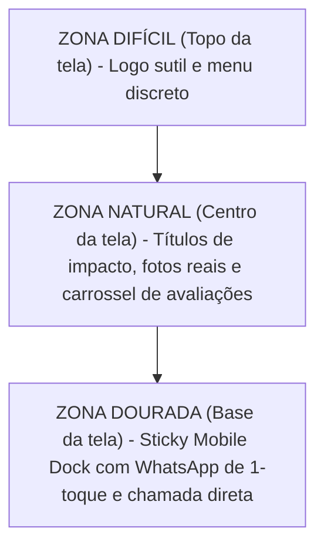
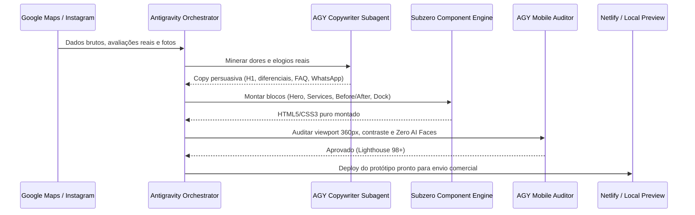

# 🌐 BLUEPRINT ESTRATÉGICO & GUIA DE ESTUDOS: TEMPLATES DE ELITE & AGY ENGINE
**Documento Avançado de Pesquisa, Psicologia de Conversão, Engenharia Frontend e Automação de Agentes**  
*Autor: Gabriel Azevedo & Antigravity (AGY)*  
*Data: Setembro de 2026 • Localização: Franca / SP*

---

## 📑 ÍNDICE GERAL
1. [A Psicologia Oculta da Conversão Local (Neuromarketing & CRO)](#1-a-psicologia-oculta-da-conversão-local)
2. [A Lei do Polegar & Ergonomia Mobile (The Mobile Thumb Zone)](#2-a-lei-do-polegar--ergonomia-mobile)
3. [Frameworks de Copywriting para Negócios Locais](#3-frameworks-de-copywriting-para-negócios-locais)
4. [Engenharia Frontend de Alta Precisão (CSS Moderno & Zero Bloat)](#4-engenharia-frontend-de-alta-precisão)
5. [Orquestração Avançada com Google Antigravity (AGY)](#5-orquestração-avançada-com-google-antigravity-agy)
6. [Os 4 Novos Arquétipos Subzero (Especificação Técnica Detalhada)](#6-os-4-novos-arquétipos-subzero)
7. [Fontes Recomendadas para Ler e Assistir (A Biblioteca de Elite)](#7-fontes-recomendadas-para-ler-e-assistir)

---

## 🧠 1. A PSICOLOGIA OCULTA DA CONVERSÃO LOCAL

Quando um consumidor de Franca e região pesquisa por *"engenheiro civil"*, *"clínica odontológica"* ou *"conserto de ar condicionado"* no Google Maps, ele **não está navegando por entretenimento**. Ele tem uma necessidade imediata, um orçamento em mãos ou uma emergência técnica.

### Os 4 Gatilhos Decisivos do Consumidor Local:
1. **Redução Radical da Incerteza (De-risking):** O maior medo do cliente de serviços de alto valor (R$ 2.000 a R$ 50.000) é contratar um profissional desqualificado que atrase a obra, cause infiltração ou suma com o sinal.
   * *Mecanismo de Cura no Site:* Selo de ART (Anotação de Responsabilidade Técnica), garantia contratual expressa em dias/anos e fotos reais de obras locais com identificação do bairro de Franca.
2. **Prova Social de Proximidade (Local Proof Bias):** Depoimentos abstratos de pessoas distantes não geram conexão. O cliente quer ver depoimentos de pessoas e locais que ele reconhece.
   * *Mecanismo de Cura no Site:* Depoimentos com citação a bairros e condomínios conhecidos (ex: *"Reforma entregue no Jardim Botânico"*, *"Instalação no Parque Universitário"*).
3. **Ancoragem de Transparência:** Sites que ocultam completamente como funciona o processo geram fricção mental.
   * *Mecanismo de Cura no Site:* Seção *"Nosso Processo em 3 Etapas Simples"* (Diagnóstico gratuito -> Orçamento detalhado sem surpresas -> Execução com garantia).
4. **Fórmula da Decisão Rápida (Micro-Fricção Zero):** Formulários de contato tradicionais com 6 campos perdem até 70% da conversão para o WhatsApp direto no Brasil.
   * *Mecanismo de Cura no Site:* Botão de WhatsApp contextual com mensagem pré-definida de 1 clique.

---

## 📱 2. A LEI DO POLEGAR & ERGONOMIA MOBILE

Mais de **82%** dos acessos de prospecção local ocorrem através de smartphones. O design que não é pensado milimetricamente para a ergonomia do polegar falha na conversão.

### Regras de Ergonomia do Padrão Subzero:
* **The Thumb Zone (Steven Hoober):** O botão de ação principal (CTA do WhatsApp) deve estar **fixado na base da tela** no mobile, onde o polegar repousa naturalmente sem exigir alongamento da mão.
* **Tamanho Mínimo de Alvo Tátil (Apple HIG & Google Material):** Nenhum botão ou link clicável pode ter menos de **48x48px** de área de toque.
* **Espaçamento Anti-Misclick:** Margem mínima de **8px** entre botões para evitar toques acidentais em telas compactas (360px a 390px).
* **Fórmula do Smart Headroom:** O topo se esconde suavemente ao rolar para baixo para dar 100% de visão ao conteúdo, e reaparece instantaneamente ao primeiro pixel rolado para cima.

---

## ✍️ 3. FRAMEWORKS DE COPYWRITING PARA NEGÓCIOS LOCAIS

Para vender sites de R$ 2.500 a R$ 5.000 para empresas locais, a copy não pode ser técnica nem entediante. Aplicamos frameworks de conversão direta:

### 3.1 Framework StoryBrand (Donald Miller)
* **O Cliente é o Herói, a Empresa é o Guia:** A empresa não deve falar de si mesma nos primeiros parágrafos. Ela deve falar do problema do cliente.
  * *Errado:* "Somos uma empresa de engenharia fundada em 2012 com ampla experiência técnica."
  * *Certo:* "Construa sua casa dos sonhos em Franca sem surpresas no orçamento ou atrasos na entrega."
* **A Estrutura do Herói:**
  1. O que o cliente deseja.
  2. O que o impede (obra atrasada, prestador sem nota fiscal, medo de prejuízo).
  3. O Guia entra em ação com um plano simples de 3 passos.
  4. Chamada clara para ação (CTA).

### 3.2 Framework PAS (Problem - Agitate - Solve)
* **Problema:** Infiltrações constantes, goteiras ou risco elétrico na empresa.
* **Agitação:** Cada semana de atraso custa milhares de reais, danifica equipamentos e gera dor de cabeça.
* **Solução:** Laudo técnico imediato com equipe credenciada e garantia formal em contrato.

---

## ⚡ 4. ENGENHARIA FRONTEND DE ALTA PRECISÃO (CSS PURO & ZERO BLOAT)

Templates feitos em React, Next.js ou WordPress carregam centenas de kilobytes de JavaScript desnecessário que degradam o Core Web Vitals no celular. O **Subzero Engine** adota a filosofia de **Vanilla Web Standards**:

### Recursos Nativos Utilizados:
1. **Tipografia Fluida com `clamp()`:**
   * `font-size: clamp(1.8rem, 4vw + 1rem, 3.2rem);`
   * Elimina dezenas de media queries e mantém títulos harmoniosos de 360px a 2560px.
2. **Container Queries (`@container`):**
   * Os cards de serviços e avaliações adaptam seu layout internamente com base no espaço do card, tornando os componentes 100% intercambiáveis.
3. **Transições de Scroll com Fórmula Subzero:**
   * Disparo preciso: `0.84 * window.innerHeight` com `rootMargin: '0px 0px -65px 0px'`.
   * Delay de percepção: `0.16s` (ancora a atenção antes do movimento).
   * Curva fluida: `0.85s cubic-bezier(0.22, 1, 0.36, 1)`.
   * Animação por item individual (cards, listas, blocos), nunca a seção inteira em bloco.
4. **Carrossel Infinito Fluido (15s):**
   * Loop contínuo com `transform: translate3d` acelerado por hardware na GPU.
   * Pausa instantânea no `:hover` e no `:active` para leitura tátil confortável.

---

## 🤖 5. ORQUESTRAÇÃO AVANÇADA COM GOOGLE ANTIGRAVITY (AGY)

O AGY atua como maestro na linha de produção de novos protótipos:

---

## 🎨 6. OS 4 NOVOS ARQUÉTIPOS SUBZERO

1. **TITAN PRIME (Industrial & Tech):** Fundo `#071330`, Ciano Néon `#1ee4ff`, Âmbar `#ffa502`. Plantão técnico, marcas parceiras, dados e especificações em `JetBrains Mono`.
2. **ATELIER ELITE (Engenharia & Arquitetura):** Carvão Nobre `#121316`, Champanhe `#c5a880`. Vitrine em grid cinematográfico, slider interativo Antes/Depois de obras, foco em ART e contrato.
3. **CLINICAL LUXE (Saúde & Odontologia):** Fundo `#ffffff`, Azul Cirúrgico `#0284c7`, Menta `#10b981`. Foco em biossegurança, conforto, tecnologia 3D e agendamento humanizado.
4. **VITAL CARE (Veterinárias & Pet):** Verde Floresta `#059669`, Âmbar `#f59e0b`. Estrutura hospitalar, carinho comprovado e rota GPS de emergência pet.

---

## 📚 7. FONTES RECOMENDADAS PARA LER E ASSISTIR

Para dominar a intersecção entre **design de alta conversão, engenharia frontend moderna e vendas de alto ticket**, estude estas referências selecionadas:

### 📖 Livros Fundamentais (Leituras Essenciais):

1. **Copywriting & Persuasão Comercial:**
   * **Building a StoryBrand** (*Donald Miller*): O guia definitivo sobre como estruturar a mensagem de um negócio colocando o cliente como herói e a empresa como guia.
   * **Breakthrough Advertising** (*Eugene Schwartz*): A bíblia dos níveis de consciência do consumidor (como abordar quem ainda não sabe que precisa de um site ou de uma reforma).
   * **Influence / As Armas da Persuasão** (*Robert Cialdini*): Princípios científicos de prova social, escassez, autoridade e compromisso aplicados a landing pages.

2. **Design Visual, UI & Tipografia:**
   * **Refactoring UI** (*Adam Wathan & Steve Schoger*): O melhor manual prático do mundo para desenvolvedores criarem interfaces profissionais sem depender de designers. Ensina hierarquia visual, espaçamento, sombras e contraste.
   * **Don't Make Me Think / Não Me Faça Pensar** (*Steve Krug*): Clássico absoluto sobre usabilidade web. Se o usuário precisar pensar para achar o botão de WhatsApp, a venda foi perdida.

3. **Engenharia Mobile & Performance:**
   * **Designing for Touch** (*Steven Hoober*): Estudo empírico sobre como as pessoas seguram smartphones e como posicionar CTAs na zona do polegar.
   * **Mobile First** (*Luke Wroblewski*): Filosofia de concepção de interfaces de dentro para fora, priorizando telas pequenas antes do desktop.

---

### 🎥 Canais do YouTube & Criadores para Assistir:

1. **Engenharia Frontend & CSS Moderno:**
   * **Kevin Powell** (*YouTube*): O maior especialista mundial em CSS moderno. Aulas sobre tipografia fluida (`clamp`), layout responsivo sem media queries e animações de scroll nativas.
   * **Web Dev Simplified** (*YouTube*): Tutoriais práticos e diretos sobre JavaScript puro, IntersectionObserver e otimização de performance.

2. **UX, Design & Conversão Visual:**
   * **Flux Academy / Ran Segall** (*YouTube*): Arquitetura de websites para clientes de alto ticket, precificação de projetos web e psicologia visual.
   * **Malewicz** (*YouTube*): Análise detalhada de interfaces, micro-interações, tipografia e design limpo.

3. **Inteligência Artificial & Agentes Autônomos:**
   * **Matthew Berman** (*YouTube*): Cobertura aprofundada de sistemas multi-agentes, MCPs (Model Context Protocol) e fluxos autônomos de automação de código.

---

### 🌐 Hubs, Portais e Documentações Oficiais:

* **GoodUI (goodui.org):** Biblioteca de testes A/B reais comprovando o que aumenta e o que derruba a taxa de conversão em landing pages.
* **web.dev (Google):** Documentação oficial do Google sobre Core Web Vitals, performance mobile e boas práticas de SEO local.
* **Nielsen Norman Group (nngroup.com):** A autoridade máxima global em pesquisa de usabilidade e comportamento do consumidor digital.
* **Awwwards & BentoGrids (bentogrids.com):** Inspiração visual de nível internacional para grids modernos e layouts contemporâneos.
